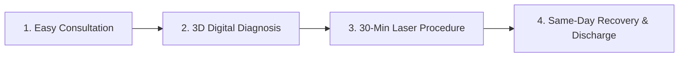

# Janki Piles Clinic - Home Page Content & SEO Deliverables

## 1. SEO Deliverables (Home Page)

- **H1**: Janki Piles Clinic - Advanced Laser Piles & Proctology Center
- **SEO Title**: Best Piles & Laser Proctology Clinic in Uttarakhand & Punjab | Janki Piles Clinic
- **Meta Title**: Janki Piles Clinic | Painless Laser Treatment for Piles, Fissure & Fistula
- **Meta Description**: Get 100% painless laser treatment for Piles, Fissure, Fistula & Pilonidal Sinus at Janki Piles Clinic. 15+ years experience, same-day discharge & cashless insurance. Book consultation today!
- **URL Slug**: `/` (Homepage)
- **Primary Keyword**: Best Piles Clinic
- **Secondary Keywords**: Laser piles surgery, proctologist near me, painless fissure treatment, fistula laser clinic, piles doctor in Dehradun, piles treatment Haridwar
- **Long-tail Keywords**: painless laser hemorrhoidectomy near me, best laser proctology clinic in Uttarakhand, same day discharge piles surgery cost, top hemorrhoid specialist near me
- **LSI Keywords**: piles doctor, hemorrhoids cure, anal fissure laser treatment, fistula in ano surgery, proctology specialist, rectal bleeding treatment, laparoscopic hernia surgery, non-surgical piles treatment
- **Search Intent**: Commercial / Transactional (Patients seeking immediate medical consultation and advanced treatment for anorectal conditions).
- **Canonical URL**: `https://www.jankipilesclinic.com/`
- **Open Graph Tags**:
  - `og:title`: Best Piles & Laser Proctology Clinic | Janki Piles Clinic
  - `og:description`: Advanced, painless laser treatment for Piles, Fissure, Fistula & Hernia across Dehradun, Haridwar, Roorkee, Haldwani & Mohali. Same-day discharge.
  - `og:type`: `website`
  - `og:url`: `https://www.jankipilesclinic.com/`
  - `og:image`: `https://www.jankipilesclinic.com/images/hero-banner-janki-piles-clinic.jpg`
- **Twitter Cards**:
  - `twitter:card`: `summary_large_image`
  - `twitter:title`: Painless Laser Piles & Fistula Surgery | Janki Piles Clinic
  - `twitter:description`: Expert proctologists offering 30-minute laser procedure with zero cuts, minimal pain, and quick recovery. Cashless TPA available.
  - `twitter:image`: `https://www.jankipilesclinic.com/images/hero-banner-janki-piles-clinic.jpg`
- **Image ALT Tags**: "Senior Proctologist explaining German Laser Technology for Piles treatment at Janki Piles Clinic"
- **Suggested Images**: High-tech modular OT, compassionate doctor consulting a patient, modern 1470nm laser device.
- **Internal Links**:
  - [Laser Piles Surgery](file:///docs/content/05_treatments_proctology.md#laser-piles-surgery)
  - [Laser Fissure Surgery](file:///docs/content/05_treatments_proctology.md#laser-fissure-surgery)
  - [Laser Fistula Surgery](file:///docs/content/05_treatments_proctology.md#laser-fistula-surgery)
  - [Dehradun Branch](file:///docs/content/07_branch_pages.md#dehradun-branch)
  - [Book Appointment](file:///docs/content/03_appointment_registration_packages.md#appointment-page)
- **External Medical Reference Suggestions**: Mayo Clinic (Hemorrhoids), NCBI Laser Proctology Studies, ASCRS (American Society of Colon and Rectal Surgeons).

---

## 2. Complete Home Page Content

### Hero Section
- **Headline**: Say Goodbye to Painful Piles & Fissures with Advanced German Laser Surgery
- **Sub Heading**: 100% Painless | No Cuts or Stitches | 30-Minute Procedure | Same-Day Discharge | Covered Under Health Insurance
- **Primary Call to Action**: [Book Laser Consultation Now]
- **Emergency Hotline Button**: [Call Emergency: +91 98765 43210]
- **WhatsApp Direct Connect**: [Chat on WhatsApp: +91 98765 43210]

---

### Key Trust Highlights Bar
- 🏆 **15,000+** Successful Laser Procedures
- 🏥 **7+** State-of-the-Art Clinic Branches
- ⏱️ **30 Min** Minimally Invasive Daycare Procedure
- 💳 **Cashless Insurance** TPA Support Available
- 🔒 **100% Confidential** Male & Female Patient Care

---

### Why Choose Janki Piles Clinic?
When dealing with sensitive anorectal problems like piles (hemorrhoids), fissures, or fistulas, delay only worsens the pain. At **Janki Piles Clinic**, we bring world-class **German 1470nm Diode Laser Technology** to deliver painless, precise, and permanent relief without the suffering associated with traditional open surgery.

#### The Janki Advantage:
1. **Zero Cuts & Stitches**: Laser energy pinpoints and shrink the diseased tissue without open incision.
2. **Minimal Blood Loss & Pain**: Preserves healthy anal sphincter muscle tone for zero fecal incontinence risk.
3. **Same-Day Discharge**: Walk into the clinic in the morning and return home comfortably by evening.
4. **Faster Recovery**: Return to routine work and daily activities within 24 to 48 hours.
5. **Ultra-Low Recurrence Rate**: Precision laser ablation minimizes chances of relapse compared to conventional cut-and-stitch surgery.
6. **Empathy & Privacy**: Dedicated lady coordinators and private consultation suites for female patients.

---

### Meet Our Lead Proctology Specialists
At Janki Piles Clinic, your care is managed by veteran proctologists and laparoscopic surgeons with over **15+ years of dedicated clinical excellence**.

> *"Our mission is simple: To eliminate the fear of surgery through compassionate care, advanced laser innovation, and complete transparency. No patient should suffer in silence."*  
> — **Dr. Senior Surgeon (MS, FMAS, Proctology Specialist)**

[Read Complete Doctor Profile & Qualifications ->](file:///docs/content/02_about_and_doctors.md)

---

### Our Core Specialized Treatments

| Treatment Name | Condition Treated | Primary Benefit | Surgery Time | Recovery |
| :--- | :--- | :--- | :--- | :--- |
| **Laser Piles Surgery** | Grade 1 - 4 Hemorrhoids | Painless shrinkage, no bleeding | 25-30 Mins | 24 Hours |
| **Laser Fissure Surgery** | Chronic Anal Fissure / Cuts | Relieves internal sphincter spasm | 15-20 Mins | 24 Hours |
| **Laser Fistula Surgery (FiLaC)** | Complex Anal Fistula | Seals fistula tract, saves sphincter | 30-45 Mins | 48 Hours |
| **Pilonidal Sinus Laser (SiLaC)** | Recurrent Tailbone Sinus | Cleans tract without open wound | 30 Mins | 24 Hours |
| **Laparoscopic Hernia Repair** | Inguinal, Umbilical, Ventral | Minimal scars, strong mesh placement | 45-60 Mins | 48 Hours |
| **ZSR Stapler Circumcision** | Phimosis, Paraphimosis | Stitchless, painless, symmetrical finish | 15 Mins | 48 Hours |
| **Hydrocele Surgery** | Testicular Swelling | Minimally invasive fluid drainage | 30 Mins | 24-48 Hours |
| **Constipation & Rectal Bleeding** | Chronic Bowel Irregularity | Comprehensive 3D Anoscopy & Dietetics | OPD Care | Immediate |

---

### Advanced Technology & Clinic Facilities
- **Modular Operation Theatres**: Ultra-clean laminar airflow OTs equipped with HEPA filtration to maintain 99.9% sterility.
- **German 1470nm Diode Laser Unit**: Precision energy beam targeted specifically at targeted vascular tissue without damaging adjoining sphincter muscles.
- **High-Definition Video Anoscopy**: Clear digital visualization of internal tissue for accurate staging before treatment.
- **Daycare Recovery Suites**: Comfortable private recovery rooms equipped with patient monitoring systems and post-op care amenities.

---

### Patient Journey & 4-Step Treatment Process

1. **Step 1: Confidential OPD Consultation**  
   Thorough medical history evaluation, clinical examination, and compassionate explanation of the condition.
2. **Step 2: Digital Anoscopy & Diagnosis**  
   Precise mapping of hemorrhoidal grade, fissure severity, or fistula tract using high-definition imaging.
3. **Step 3: 30-Minute Laser Surgery**  
   Walk-in daycare procedure under mild local/regional anesthesia with zero scalpel cuts.
4. **Step 4: Same-Day Discharge & 24/7 Care**  
   Walk home the same day with personalized dietary planning, pain management, and follow-up guidance.

---

### Insurance & Cashless TPA Facilities
We believe quality healthcare should be accessible and stress-free. Janki Piles Clinic partners with leading insurance providers and Third Party Administrators (TPAs) to offer **0% hassle cashless hospitalization**.

- **Empaneled TPAs & Insurance Providers**: Star Health, HDFC ERGO, ICICI Lombard, Max Bupa/Niva Bupa, Care Health, Religare, SBI General, Bajaj Allianz, PSU Health Plans (CGHS, EHS eligible support).
- **Free Insurance Help Desk**: Our dedicated insurance team handles approval documentation, pre-authorization, and claims settlement directly.

---

### Before & After Care Summary

#### Before Surgery (Pre-Op Care):
- 8-hour fasting protocol prior to morning daycare procedure.
- Mild bowel cleansing as prescribed by the clinical team.
- Routine pre-anesthesia blood profile and ECG clearance.

#### After Surgery (Post-Op Care):
- High-fiber diet with ample fluids starting same evening.
- Warm sitz bath 2-3 times daily for soothing anal hygiene.
- Stool softeners prescribed for smooth bowel evacuation.
- Resume light walking immediately; avoid heavy weightlifting for 10-14 days.

---

### Verified Patient Reviews & Success Stories

> ⭐⭐⭐⭐⭐ **"Life-changing experience after 4 years of piles suffering!"**  
> *"I was terrified of conventional piles surgery due to rumors of terrible pain. Dr. at Janki Piles Clinic performed laser surgery. I went home the same evening and resumed office within 2 days with zero pain. God bless the team!"*  
> — **Ramesh Verma (Dehradun)**

> ⭐⭐⭐⭐⭐ **"Fastest fissure recovery ever!"**  
> *"Suffered from severe bleeding and sharp pain while passing stool for months. Laser fissure surgery took just 15 minutes. Pain vanished almost completely by next morning."*  
> — **Priya Sharma (Haridwar)**

---

### Frequently Asked Questions (Homepage FAQ Schema Integrated)

#### Q1: Is laser surgery for piles completely painless?
**Ans**: Laser piles treatment is virtually painless. Because there are no scalpel cuts or open wounds in the sensitive anal area, pain is minimized by 90-95% compared to open hemorrhoidectomy. Most patients require only mild analgesics for 24 hours.

#### Q2: How many days of bed rest are required after laser piles surgery?
**Ans**: No prolonged bed rest is needed. Patients can walk independently 2-3 hours after the procedure and resume normal office or light domestic duties within 24 to 48 hours.

#### Q3: Does health insurance cover laser piles and fistula surgery at Janki Piles Clinic?
**Ans**: Yes, laser proctology procedures are medically approved surgical treatments and are fully covered by major health insurance policies and TPA providers. Our helpdesk assists you with 100% cashless approvals.

---

### Convenient Multi-Branch Locations

- **Dehradun Main Clinic**: Rajpur Road / Near ISBT, Dehradun, Uttarakhand.
- **Haridwar Clinic**: Ranipur More / Delhi-Haridwar Highway, Haridwar.
- **Roorkee Clinic**: Civil Lines / Canal Road, Roorkee.
- **Bhaniyawala Clinic**: Jolly Grant Airport Road, Bhaniyawala.
- **Srinagar Garhwal Clinic**: Main Market / Medical College Road, Srinagar.
- **Haldwani Clinic**: Bareilly-Nainital Road, Haldwani.
- **Mohali Branch**: Sector 62 / Phase 7, Mohali (Chandigarh Tricity).

---

### Book Your Consultation Today

Don't let embarrassment or fear of painful surgery hold you back from living a healthy, active life. Talk to our senior proctology specialists in complete confidence today.

- 📞 **Direct Helpline**: +91 98765 43210
- 💬 **WhatsApp Consultation**: +91 98765 43210
- 📧 **Email**: info@jankipilesclinic.com
- 🌐 **Online Appointment Form**: [Click Here to Book Online Slot](file:///docs/content/03_appointment_registration_packages.md#appointment-page)
