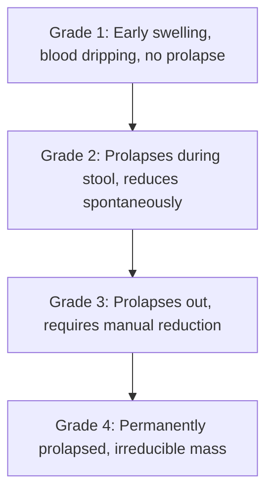

# Janki Piles Clinic - Proctology Treatment & Laser Surgery Guides

This document contains full clinical content and complete 20 SEO deliverables for Proctology & Laser Procedures at Janki Piles Clinic.

---

## 1. PILES (HEMORRHOIDS) TREATMENT PAGE

### 1.1 Complete 20 SEO Deliverables (Piles)
- **1. H1**: Piles Treatment & Painless German Laser Surgery Center
- **2. SEO Title**: Best Piles Doctor & Painless Laser Piles Surgery | Janki Piles Clinic
- **3. Meta Title**: Piles (Hemorrhoids) Treatment | Painless Laser Surgery
- **4. Meta Description**: Get 100% painless laser treatment for Piles (Bawaseer) at Janki Piles Clinic. 30-min daycare procedure, zero cuts or stitches, same-day discharge & cashless TPA. Book now!
- **5. URL Slug**: `/treatments/piles-treatment`
- **6. Primary Keyword**: Piles Treatment
- **7. Secondary Keywords**: hemorrhoids surgery, laser piles doctor, bawaseer ka ilaj, painless piles cure, proctologist near me
- **8. Long-tail Keywords**: best laser piles treatment in Dehradun Haridwar Haldwani, grade 4 hemorrhoids laser surgery cost, non surgical piles cure clinic
- **9. LSI Keywords**: anal piles, internal hemorrhoids, external hemorrhoids, rectal bleeding, prolapsed hemorrhoids, hemorrhoidectomy, 1470nm diode laser
- **10. Search Intent**: Transactional / Commercial (Patients suffering from bleeding or painful piles looking for effective, painless laser cure).
- **11. Complete Page Content**: (See Clinical Content below)
- **12. Call To Action**: [Book Painless Laser Piles Consultation] / [Talk to Piles Specialist]
- **13. FAQ Section**: 5 Detailed Clinical FAQs included.
- **14. Internal Links**:
  - [Laser Piles Surgery Page](#7-laser-piles-surgery-lhp-procedure-page)
  - [Fissure Treatment](#2-fissure-anal-fissure-treatment-page)
  - [Fistula Treatment](#3-fistula-fistula-in-ano-treatment-page)
  - [Dehradun Branch](file:///docs/content/07_branch_pages.md#dehradun-branch)
- **15. Schema Recommendations**:
  - `MedicalCondition`: Hemorrhoids (ICD-10-CM K64)
  - `MedicalProcedure`: Laser Hemorrhoidoplasty (LHP)
  - `FAQPage`
  - `BreadcrumbList`
- **16. Image ALT Tags**: "Advanced German Diode Laser treatment for Grade 3 piles at Janki Piles Clinic"
- **17. Suggested Images**: Anatomic breakdown of piles grades, laser diode machine, doctor demonstrating procedure on model.
- **18. Open Graph Tags**:
  - `og:title`: Painless Laser Piles Surgery | Janki Piles Clinic
  - `og:description`: Permanent, stitchless laser solution for internal & external piles. Discharged same day.
  - `og:type`: `article`
  - `og:url`: `https://www.jankipilesclinic.com/treatments/piles-treatment`
- **19. Twitter Cards**:
  - `twitter:card`: `summary_large_image`
  - `twitter:title`: Best Laser Piles Doctor & Treatment | Janki Piles Clinic
  - `twitter:description`: Say goodbye to painful piles. 30-minute laser procedure with zero cuts.
- **20. Canonical URL**: `https://www.jankipilesclinic.com/treatments/piles-treatment`

---

### 1.2 Clinical Content (Piles / Hemorrhoids)

#### Introduction
Piles, medically known as **Hemorrhoids** (often called *Bawaseer* in Hindi), affect millions of individuals, causing severe physical discomfort, painless or painful rectal bleeding, and emotional distress. At **Janki Piles Clinic**, we specialize in cutting-edge **German Laser Hemorrhoidoplasty (LHP)**, providing a permanent, 100% painless solution that eliminates piles without any scalpel cuts, stitches, or long hospital stays.

#### What is Piles (Hemorrhoids)?
Piles are swollen, inflamed blood vessels (veins) situated in the submucosal layer of the lower rectum and anus. When pressure increases in the pelvic area, these veins become engorged, stretched, and protrude outwards, leading to tissue prolapse and bleeding during bowel movements.

#### Symptoms of Piles
- **Painless Bleeding**: Bright red blood dripping into the toilet bowl or staining toilet paper.
- **Prolapse / Mass Protrusion**: Lump or soft tissue coming out of the anus during defecation.
- **Anal Itching & Irritation**: Continuous mucus discharge causing skin excoriation.
- **Pain & Discomfort**: Severe pain occurs when piles become thrombosed (clotted) or inflamed.
- **Feeling of Incomplete Evacuation**: Sensation that bowels haven't cleared completely.

#### Causes of Piles
- **Chronic Constipation**: Excessive straining during bowel passage.
- **Low-Fiber Diet**: Processed foods, refined flour (maida), and insufficient water intake.
- **Sedentary Lifestyle**: Prolonged sitting at desk jobs or long drives.
- **Pregnancy & Childbirth**: Increased intra-abdominal pelvic pressure.
- **Obesity & Chronic Cough**: Persistent strain on lower abdominal veins.
- **Hereditary Predisposition**: Genetic weakness of anal sphincter connective tissue.

#### Risk Factors
- Ageing (weakening of vascular support tissues in adults above 30).
- Heavy weightlifting without proper core support.
- Chronic diarrhea or excessive reliance on laxatives.

#### Stages / Grading of Internal Piles

#### Complications of Untreated Piles
- **Severe Anemia**: Chronic blood loss leading to fatigue, weakness, and low hemoglobin levels.
- **Thrombosis & Strangulation**: Blood supply cut off to prolapsed piles causing tissue necrosis and extreme pain.
- **Perianal Abscess & Infection**: Ulceration of exposed pile masses.

#### Treatment Options Overview

| Feature | Conventional Surgery (Open Hemorrhoidectomy) | German Laser Surgery (LHP at Janki Clinic) |
| :--- | :--- | :--- |
| **Cut & Stitches** | Open cuts, multiple painful stitches | **Zero cuts, Zero stitches** |
| **Pain Level** | Severe post-op pain (requires bed rest) | **Minimal to zero pain** |
| **Bleeding** | High blood loss during/after surgery | **Virtually zero blood loss** |
| **Hospital Stay** | 2 - 3 Days | **Same-Day Discharge (3-4 hours)** |
| **Recovery Time** | 3 - 4 Weeks | **24 - 48 Hours** |
| **Recurrence Rate** | Moderate | **Ultra-Low (<1%)** |

#### Advanced Laser Piles Treatment Procedure (LHP Mechanism)
Under mild short-acting anesthesia, a high-precision 1470nm laser optical fiber is inserted directly into the center of the hemorrhoidal node. Controlled laser energy beams shrink the piles mass from within, obliterating the arterial blood supply feeding the hemorrhoid. The tissue contracts, heals, and seals natural submucosal structures without damaging the anal sphincter muscle.

#### Key Benefits of Laser Surgery
- 30-minute daycare procedure.
- Preserves anal sphincter control (zero risk of incontinence).
- Immediate pain relief and minimal post-op wound care.
- Covered under Cashless Health Insurance.

#### Recovery Timeline & Post-Op Care
- **Day 1**: Discharge from clinic within 4 hours; light walking encouraged.
- **Day 2**: Normal home routine, minimal pain, light stool evacuation.
- **Day 3-5**: Return to office or work with full comfort.

#### Post-Op Diet & Nutrition Guidelines
- **High-Fiber Foods**: Oats, papaya, green leafy vegetables, apples, whole grains.
- **Hydration**: Drink 3-4 liters of water daily.
- **Avoid**: Spicy food, red meat, alcohol, caffeine, and deep-fried items.

#### Frequently Asked Questions (Piles FAQs)

##### Q1: Can piles be cured without surgery?
**Ans**: Grade 1 and early Grade 2 piles can often be managed with diet, high fiber, sitz baths, and laxatives. However, Grade 3 and Grade 4 piles require definitive laser ablation to shrink the permanent tissue mass.

##### Q2: Is laser piles surgery safe for diabetic and elderly patients?
**Ans**: Yes! Because laser surgery involves zero open wounds and minimal blood loss, it is exceptionally safe for diabetic, hypertensive, and elderly patients.

##### Q3: How long does the laser piles procedure take?
**Ans**: The procedure itself takes approximately 20 to 30 minutes inside our state-of-the-art operation theatre.

##### Q4: Will piles recur after laser treatment?
**Ans**: The recurrence rate after German LHP laser surgery is under 1% when patients follow basic dietary and lifestyle guidelines.

##### Q5: Is sitz bath necessary after laser piles surgery?
**Ans**: Yes, warm sitz baths (sitting in warm water for 10-15 minutes) twice daily for a few days promote muscle relaxation and perianal hygiene.

---

## 2. FISSURE (ANAL FISSURE) TREATMENT PAGE

### 2.1 Complete 20 SEO Deliverables (Fissure)
- **1. H1**: Painless Laser Anal Fissure Surgery & Chronic Fissure Cure
- **2. SEO Title**: Best Anal Fissure Doctor & Laser Fissure Surgery | Janki Piles Clinic
- **3. Meta Title**: Anal Fissure Treatment | Painless Laser Sphincterotomy
- **4. Meta Description**: Suffering from sharp severe pain and bleeding while passing stool? Get 100% painless Laser Fissure Surgery at Janki Piles Clinic. Discharged same day!
- **5. URL Slug**: `/treatments/fissure-treatment`
- **6. Primary Keyword**: Fissure Treatment
- **7. Secondary Keywords**: anal fissure surgery, fissure doctor near me, painless fissure laser cure, fissure ka permanent ilaj
- **8. Canonical URL**: `https://www.jankipilesclinic.com/treatments/fissure-treatment`

### 2.2 Clinical Content (Anal Fissure)
- **What is Anal Fissure**: A sharp linear tear or cut in the moist mucosal lining of the lower anal canal, usually caused by hard stool.
- **Symptoms**: Severe knife-like sharp cutting pain during and after defecation (lasting hours), bright red blood streak on stool surface, visible crack, and sentinel skin tag (in chronic fissure).
- **Causes**: Passing hard dry stools, chronic constipation, childbirth trauma, hyperactive anal sphincter tone.
- **Laser Treatment (FILAC / Laser Sphincterotomy)**: Laser energy relaxes the spasm of the internal anal sphincter muscle and vaporizes the chronic ulcer tissue without open cuts, immediately halting pain.
- **Recovery & Diet**: Return to work in 24 hours, painless stool evacuation within 24 hours with softeners and sitz baths.

---

## 3. FISTULA (FISTULA-IN-ANO) TREATMENT PAGE

### 3.1 Complete 20 SEO Deliverables (Fistula)
- **1. H1**: Laser Anal Fistula Surgery (FiLaC) - Sphincter-Saving Treatment
- **2. SEO Title**: Best Fistula Specialist & FiLaC Laser Fistula Surgery | Janki Piles Clinic
- **3. Meta Title**: Fistula Treatment | FiLaC Laser Fistula Surgery
- **4. Meta Description**: Permanent cure for complex anal fistula with German FiLaC Laser Surgery. Saves anal sphincter muscles, zero incontinence risk & fast 48h recovery.
- **5. URL Slug**: `/treatments/fistula-treatment`
- **6. Primary Keyword**: Fistula Treatment
- **7. Secondary Keywords**: FiLaC laser fistula surgery, anal fistula doctor near me, Bhagandar treatment, complex fistula specialist
- **8. Canonical URL**: `https://www.jankipilesclinic.com/treatments/fistula-treatment`

### 3.2 Clinical Content (Anal Fistula)
- **What is Anal Fistula**: An abnormal infected tunnel connecting an internal opening inside the anal canal to an external opening on the skin surrounding the anus (*Bhagandar*).
- **Symptoms**: Recurrent pus or bloody discharge, perianal swelling, throbbing pain, low-grade fever.
- **Causes**: Un-drained or poorly healed perianal abscess, infected anal glands.
- **FiLaC Laser Procedure**: A flexible radial laser probe is inserted into the fistula tract. As laser energy is emitted 360°, the infected tissue is photocoagulated and the tunnel is sealed internally without cutting anal sphincter muscles.
- **Major Advantage**: Zero risk of fecal incontinence compared to conventional open fistulotomy.

---

## 4. PILONIDAL SINUS TREATMENT PAGE

### 4.1 Complete 20 SEO Deliverables (Pilonidal Sinus)
- **1. H1**: Pilonidal Sinus Laser Surgery (SiLaC) - Tailbone Cyst Cure
- **2. SEO Title**: Best Pilonidal Sinus Doctor & Laser Surgery (SiLaC) | Janki Piles Clinic
- **3. Meta Title**: Pilonidal Sinus Treatment | Painless SiLaC Laser Procedure
- **4. Meta Description**: Permanent, stitchless laser cure for Pilonidal Sinus at tailbone. Zero open wounds, fast healing, low recurrence. Book consultation!
- **5. URL Slug**: `/treatments/pilonidal-sinus-treatment`
- **6. Primary Keyword**: Pilonidal Sinus Treatment
- **7. Secondary Keywords**: SiLaC laser pilonidal sinus, tailbone cyst doctor, pilonidal sinus surgery cost
- **8. Canonical URL**: `https://www.jankipilesclinic.com/treatments/pilonidal-sinus-treatment`

### 4.2 Clinical Content (Pilonidal Sinus)
- **What is it**: An infected hair-containing nest/tunnel located in the natal cleft at the top of the buttocks near the tailbone (coccyx).
- **Target Patient Group**: Young adults, office workers, drivers, individuals with heavy body hair.
- **SiLaC Laser Technique**: Laser probe cleans and seals the sinus tract from within without creating a giant open wound that takes months to dressing heal.

---

## 5. CONSTIPATION TREATMENT PAGE (`/treatments/constipation-treatment`)
- Comprehensive clinical evaluation of chronic constipation, slow-transit bowel disorders, pelvic floor dyssynergia, biofeedback therapy, dietary re-education, and medical management.

---

## 6. RECTAL BLEEDING TREATMENT PAGE (`/treatments/rectal-bleeding-treatment`)
- Expert diagnostic protocol for rectal bleeding (*Lahoo Aana*), differential diagnosis between Piles, Fissure, Polyps, Inflammatory Bowel Disease (IBD), and Colorectal Malignancy screening.

---

## 7. LASER PILES SURGERY (LHP PROCEDURE PAGE) (`/treatments/laser-piles-surgery`)
- In-depth surgical technique breakdown of German 1470nm Laser Hemorrhoidoplasty, optical fiber specs, energy dosing, pre-op evaluation, and day-care hospitalization protocol.

---

## 8. LASER FISSURE SURGERY PAGE (`/treatments/laser-fissure-surgery`)
- Detailed breakdown of Laser Sphincterolysis / Sphincterotomy vs open lateral internal sphincterotomy.

---

## 9. LASER FISTULA SURGERY (FiLaC PAGE) (`/treatments/laser-fistula-surgery`)
- 3D tract mapping, MRI Fistulogram guidance, FiLaC laser closure, and post-laser hygiene protocols.
